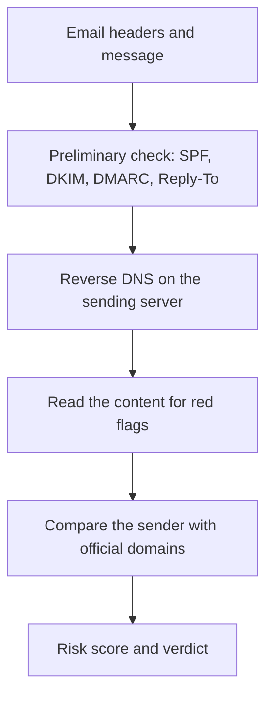

# Epiderm

Explainable trust and impersonation risk assessment. Innovators Conclave 2026, Track 01 (AI), PS-02: AI for digital trust.

Give it a suspicious message, an email with an attachment, or a document. It answers in plain words: **LOOKS LEGIT**,
**SUSPICIOUS** or **NOT LEGIT**, with a 0-100 security score, the evidence behind it, and what to do next.

## The solution

Epiderm does not just ask "is this fake?". It checks whether the sender, the document and the context agree, and explains why.
It looks at the envelope before it reads the letter.

### Email verification: the envelope before the letter

**Step 1: before we read any content.** Every email carries hidden authentication results that are hard to fake, so we check them first.

| Check | Plain-English meaning | What a failure tells us |
|---|---|---|
| **SPF** (the guest list) | Is the server that sent this allowed to send mail for that domain? | The sender may be a stranger using the company's name |
| **DKIM** (the wax seal) | Is the message signed by the domain, and unchanged on the way? | It may be forged or altered in transit |
| **DMARC** (the house rules) | Does the visible From address match, and what should happen if a check fails? | The visible sender is not the real one |

We also check whether **Reply-To** quietly points somewhere else, and whether the sender's domain is a look-alike (`gmial.com`).

**The pipeline:**

### Reverse DNS, content and the risk score

1. **Reverse DNS lookup.** Every sending server has a number (an IP address). We look it up backwards to see the name it gives itself.
   A real Acme email comes from a server that names itself `acmecorp.com`. No name, or the wrong name, is a warning.
2. **Read the content.** Wording that flags scams: urgency, secrecy, "pay a fee first", OTP requests, changed bank details,
   "don't call me". A local AI reads the context, and every quote it gives must appear in the text or it is dropped.
3. **Comprehensive risk score.** Each warning has a strength and a confidence. They combine into one 0-100 security score and a
   verdict. Reassuring signs never hide a warning, and for a message plus its attachment the worst part wins.

Real results from the demo files in `samples/demo/`:

| File | Verdict | Security score |
|---|---|---|
| Fake loan email (fails SPF, DKIM and DMARC) | NOT LEGIT | 1 |
| Genuine Acme Corp email | LOOKS LEGIT | 97 |

### Documents and images

The same idea: check how it was made before, and what it says after.

**Documents**
- **File history:** made in Photoshop? changed after it was created? macros?
- **Contents**, read inside a private container: PDF, Word, Excel and PowerPoint.
- **Numbers:** real check digits on GSTIN, PAN, IFSC and IBAN. An impossible number is flagged; a valid one is neutral, never reassuring.
- **Context:** payee against issuer, look-alike email domains, contradictory dates, pay-first wording.
- **AI reading:** a local AI extracts who is asking to be paid and how much, then every claim is verified against the document text.

**Images**
- The same file-history checks: AI tool markers, edits and content credentials (C2PA).
- Photographed invoices: the AI reads the text inside the picture.
- An optional local image-forensics lab (camera-sensor patterns, two AI-image detectors and a heatmap) opens from a link.
  It is research-grade evidence and is not part of the score.
- Uploads are held in memory only and never stored.

An email and its attachment go through both pipelines and are combined: the worst verdict wins.

## What it checks

| Category | What it looks at |
|---|---|
| Phishing and email | Message wording and pressure tactics, pasted email headers (SPF, DKIM, DMARC, sending server via reverse DNS), the sender's address against a curated list of official company domains |
| Document verification | How the file was made (metadata, edits after creation, macros), its contents (text from PDF, Word, Excel, PowerPoint and images), tax and bank identifiers with real check digits (GSTIN, PAN, IFSC, IBAN), hidden text and sheets, changed payment details, pay-first requests, look-alike email domains, contradictory dates, payee name against issuer |
| Image and persona | AI-generation markers and editing traces in a photo's metadata. Voice, video and face checks are not built yet |

An email and its attachment go through both pipelines and are combined: the worst verdict wins, so a friendly
message cannot hide a forged invoice.

## Design rules

- **The verdict comes from transparent rules.** A reasoning model reads the text first, but it can only add concerns. It never lowers a verdict.
- **The model's output is untrusted data.** Every quote and value it returns must appear verbatim in the source text or it is dropped. Its "does not add up" claims are shown but never scored. A small local model's findings count for less.
- **A valid identifier is not reassuring.** A check digit can prove a number is impossible, never that it belongs to this vendor.
- **The AI never supplies official contact details.** Only the human-curated list in `backend/` is used. An unknown company is "cannot verify".
- **Fail closed.** If the sandbox is required but unavailable, the request is refused. A file that fails inside the sandbox is refused, never parsed outside it.
- **Unchecked is not the same as suspicious.** Every result lists what could not be checked.

The score sits inside its verdict's range (0-30 legit, 38-68 suspicious, 72-100 not legit) and rises with the combined
weight of the warning signs. See `backend/app/risk.py`.

## Run

Backend (port 8001):

    cd backend
    pip install -r requirements.txt
    python -m uvicorn app.main:app --port 8001
    python -m pytest -q

Frontend (port 3000):

    cd frontend
    npm install
    npm run dev

The frontend reads `NEXT_PUBLIC_API_URL` from `frontend/.env.local` (default `http://127.0.0.1:8001`).

## Reasoning model

Set in `backend/.env` (copy `backend/.env.example`; never commit `.env`).

- `TRUSTGUARD_PROVIDER=ollama` uses a local model (default `gemma3:4b`), so text and images never leave the computer. Slow on modest hardware (30-140 s per check).
- `gemini` or `anthropic` use an API model instead when a key is set.
- With no model, the fixed rule-based checks still run.

## Private sandbox (Docker)

When a person picks a category, the app opens their own private container. Every uploaded file and every pasted
block of email headers is parsed inside it. It has no network, a read-only filesystem, no privileges, a 256 MB
memory cap, a process cap and a 30 second limit per check, and runs as a non-root user. Only a small JSON result
comes back, and the main server validates it again. The container is deleted when the person leaves the screen or
closes the tab, after 10 idle minutes (`TRUSTGUARD_SESSION_IDLE_SECONDS`), or when the server stops. At most 6
sessions are open at once (`TRUSTGUARD_MAX_SESSIONS`).

Build the image once (Docker Desktop running), and again whenever `backend/app/analyzers/` changes:

    cd backend
    docker build -f Dockerfile.sandbox -t trustguard-sandbox .

`TRUSTGUARD_SANDBOX` in `backend/.env`: `auto` (default: use it when the image is ready, and say so on screen if not),
`docker` (require it; requests fail with 503 if missing), or `off`.

Not covered: the AI model call (runs on the host) and plain message text, which is not parsed. The main app does not
run inside Docker on purpose: that would need the Docker socket mounted, which gives a compromised app control of the machine.
The corner badge in the app says honestly whether the sandbox is active.

## Report

After any check, **Download report** produces a one-page PDF with the verdict, score, findings and next steps. It is built
in memory and leaves out the full text of the message and document, so it is safe to send to a bank or the cybercrime portal.

## Layout

    backend/
      app/
        main.py             API: /analyze-text, /analyze-document, /analyze-email (all with /stream), /report, /sessions
        risk.py             risk score, area breakdown, likelihood x impact matrix
        report.py           PDF report
        documents.py        document pipeline: sandbox read -> model reads contents -> verify -> verdict
        reasoning.py, llm.py  model integration (Ollama / Gemini / Claude), guardrails
        sandbox.py, worker.py Docker sandbox and its in-container worker
        analyzers/          text, email, headers, document, content, identifiers, ip
        models.py           shared data contracts
      tests/                pytest suite, incl. a 14-document corpus (tests/corpus.py)
      scripts/eval_documents.py   live evaluation of the corpus against the running model
      Dockerfile.sandbox    the sandbox image
    frontend/app/           Next.js UI: category picker, email and document screens, risk dashboard, sandbox badge
    website/                the Epiderm landing page (static, no build step)
    samples/                sample files for trying the checks

Two things are still simulated: the scenario files in `backend/scenarios/` (session data such as IP and device) are labelled as such, and
the voice, video and face checks are not built.
